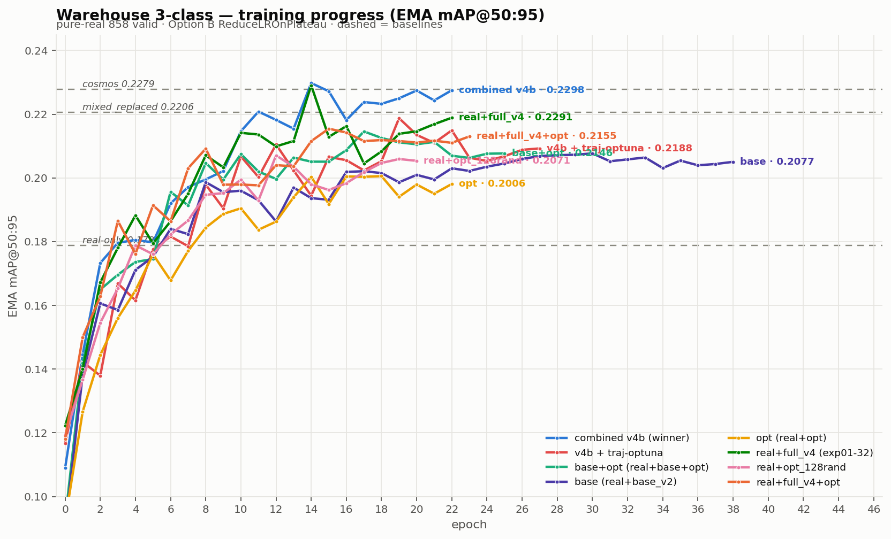
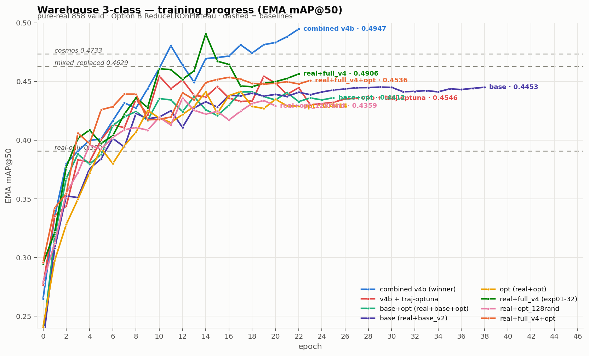

# Warehouse 3-Class Detector — Synthetic-Data Training Report

**Task:** object detection for `forklift`, `pallet`, `pallet_truck` (RF-DETR base, COCO-pretrained, head re-init to 3 classes).
**Evaluation:** every number below is **EMA mAP on the pure-real 858-image LOCO validation set** — the same ruler for all runs, so results are directly comparable.
**Report generated:** 2026-07-16 — all 10 runs complete.

---

## 1. Why one fixed validation set matters

An early run (`mixed_replaced`) logged **0.3541** mAP@50:95 — but on its *own* mixed valid (910 images = 858 real + **52 synthetic**). Re-scored on the pure-real 858 valid it was **0.2206**. The 52 synthetic frames (which are near-in-distribution and easy) inflated the headline by **+0.133**.

> **Rule adopted:** all cross-run comparison is done on the pure-real 858 valid via `od_scripts/eval_checkpoint.py`. Every figure in this report follows it.

---

## 2. Training recipe (identical across runs)

All runs use the **in-process ReduceLROnPlateau** wrapper `od_scripts/train_warehouse_reduce_lr.py` ("Option B"):

| Setting | Value |
|---|---|
| Optimizer | AdamW, lr **1e-4** / encoder **1.5e-4** |
| LR schedule | ReduceLROnPlateau — factor 0.1, patience 3, min-Δ 5e-4, floor **1e-6**, monitor `val/ema_mAP_50_95` |
| Early stop | patience 8 (on EMA), max 60 epochs |
| Batch | 4 × grad-accum 4 (eff. 16) |
| Checkpoint | deployable = `checkpoint_best_ema.pth` |

It replaces the older 3-stage subprocess `plateau_driver.py` (which the `cosmos` baseline used) with a single training run — same effective policy, cleaner logs.

---

## 3. Datasets

Every dataset shares the **same 4,110 real** LOCO images and the **858 real valid**; they differ only in the *synthetic* data added to `train`.

| Dataset | Train imgs | Synthetic component |
|---|---:|---|
| **real-only** (`warehouse3cls_real`) | 4,110 | — (baseline) |
| **base** | 6,978 | base_v2 random-frame (2,868) |
| **opt** | 6,160 | May calibration-loop / Optuna iters (2,050) |
| **base+opt** | 9,028 | base_v2 + calib-loop (2,868 + 2,050) |
| **combined v4b** ⭐ | 12,765 | base_v2 + calib-loop + **traj-v4b** (3,737) |
| **v4b + traj-optuna** | 16,915 | combined v4b + Optuna-tuned trajectory renders (4,150) |
| real + full-v4 | 10,351 | new v4 exp01–32 (128-seed exp01–06 + 128-rand exp07–32) |
| real + opt_128rand | 6,871 | regenerated Optuna renders (2,761) |
| real + full-v4 + opt | 13,112 | full-v4 + opt_128rand |

*Synthetic source notes:* **base_v2** = old random-frame SDG; **traj-v4b** = wall-fixed trajectory v4 re-run; **calib-loop/opt** (in `base_opt`/`opt`) = May `top-runs-may-ok` iterations recovered from S3; **traj-optuna** & **opt_128rand** = Optuna-winner configs re-rendered 2026-07-15. The **new v4** was rendered in two folders — `train_v4_128seed` (exp01–06) + `train_v4_128rand` (exp07–32) — combined here as "full-v4".

---

## 4. Results so far (EMA, pure-real 858 valid)

| Run | mAP@50:95 | mAP@50 | Δ50:95 vs real-only | Status |
|---|---:|---:|---:|---|
| **combined v4b (winner)** ⭐ | **0.2298** | **0.4947** | **+0.0510** | done |
| **real + full-v4 (exp01–32)** 🆕 | **0.2291** | **0.4906** | **+0.0503** | done |
| cosmos (traj-v4 + cosmos) | 0.2279 | 0.4733 | +0.0491 | baseline |
| mixed_replaced (re-eval) | 0.2206 | 0.4629 | +0.0418 | baseline |
| v4b + traj-optuna | 0.2188 | 0.4545 | +0.0400 | done |
| real + full-v4 + opt 🆕 | 0.2155 | 0.4536 | +0.0367 | done |
| base+opt (real+base+opt) | 0.2146 | 0.4412 | +0.0358 | done |
| base (real+base_v2) | 0.2077 | 0.4453 | +0.0289 | done |
| real + opt_128rand 🆕 | 0.2071 | 0.4359 | +0.0283 | done |
| opt (real+calib-loop) | 0.2006 | 0.4414 | +0.0218 | done |
| **real-only** | **0.1788** | **0.3906** | — | baseline |

---

## 5. Plots

### EMA mAP@50:95 vs epoch

### EMA mAP@50 vs epoch

Solid curves = the trained runs; dashed lines = fixed baselines (**cosmos**, **mixed_replaced**, **real-only**).

---

## 6. What the results say

1. **Synthetic data clearly helps.** Real-only sits at **0.1788**; every synth-augmented set beats it. The best (combined v4b) adds **+0.051 mAP@50:95 (+0.104 mAP@50)** over real-only.
2. **Each single synth source is weak on its own** (~0.20): calib-loop `opt` 0.2006 ≈ `base` 0.2077. They are **complementary** — `base+opt` 0.2146.
3. **The trajectory-v4b synth is the decisive ingredient.** `base+opt` 0.2146 → `combined v4b` **0.2298** (+0.015), and it is the **only configuration that beats the cosmos baseline** (0.2279) on the fair valid.
4. **mAP@50 gap is even larger:** combined v4b **0.4947** vs cosmos 0.4733 (+0.021) and real-only 0.3906 (+0.104).
5. **More synth is not always better.** Layering the Optuna-optimized trajectory stills on top of the winner (`v4b + traj-optuna`) **regressed** it: 0.2298 → **0.2188** (−0.011). Those renders added distribution shift rather than signal — the winner (real + base + calib-opt + traj-v4b) remains best.
6. **The regenerated full-v4 alone nearly equals the winner — with a far simpler recipe.** `real + full-v4 (exp01–32)` hits **0.2291** (mAP@50 **0.4906**) — statistically tied with the combined winner (0.2298) and above cosmos, using just real + one clean v4 render (no base_v2, no calib-loop, no traj-v4b). The 2026-07-15 v4 render is the strongest single synth source to date. *(On mAP@50 it's 0.4906 vs the winner's 0.4947 — the closest contender.)*
7. **Regenerated Optuna renders beat the old calib-loop opt.** `real + opt_128rand` **0.2071** > old `opt` (calib-loop) **0.2006** (+0.007) — the re-rendered Optuna configs are a cleaner opt source.
8. **"opt on top" hurts again, consistently.** Adding opt to full-v4 dropped it **0.2291 → 0.2155** (−0.014), mirroring traj-optuna's regression of the v4b winner. Optuna-derived stills degrade an already-strong trajectory set rather than help.

**Takeaway:** the best detector comes from **real + a strong trajectory v4 render** (combined-v4b 0.2298 ≈ real+full-v4 0.2291). Piling on more synth sources — especially Optuna-optimized stills — does not help and often hurts.

---

## 7. Reproduce

| Purpose | Script |
|---|---|
| Train (Option B ReduceLROnPlateau) | `od_scripts/train_warehouse_reduce_lr.py` |
| Fair eval of any checkpoint on 858 valid | `od_scripts/eval_checkpoint.py` |
| Master comparison table | `od_scripts/compare_ablation.py` |
| Build combined / ablation / real+synth datasets | `od_scripts/build_mixed_v4b.py`, `build_ablation_cleanval.py`, `build_real_plus_synth.py`, `build_combo_datasets.py` |
| These plots | `plot_report.py` (scratchpad) |
